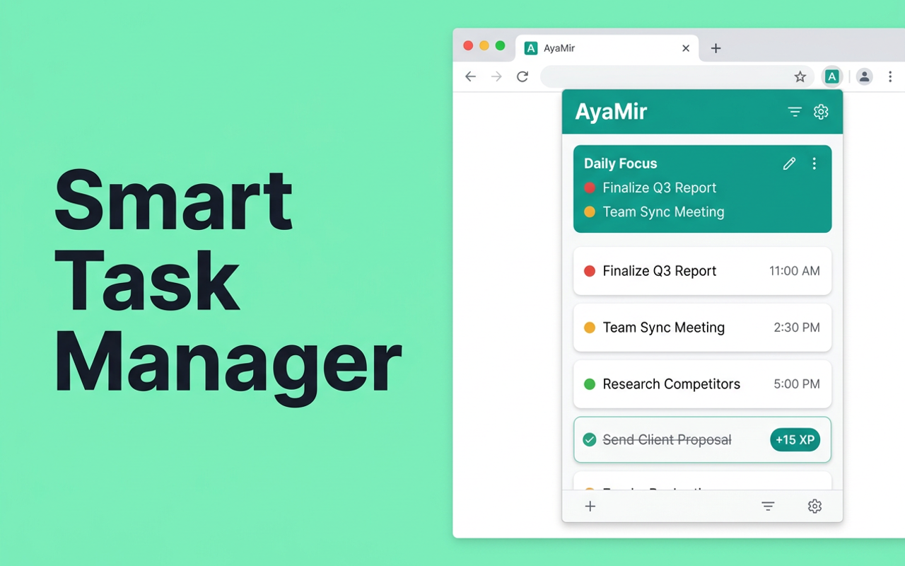
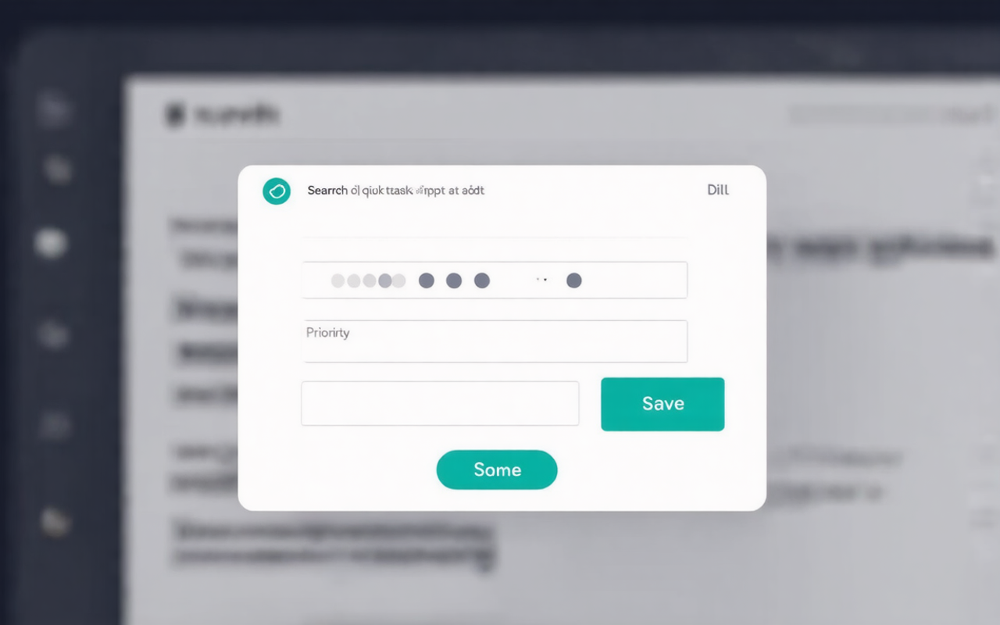
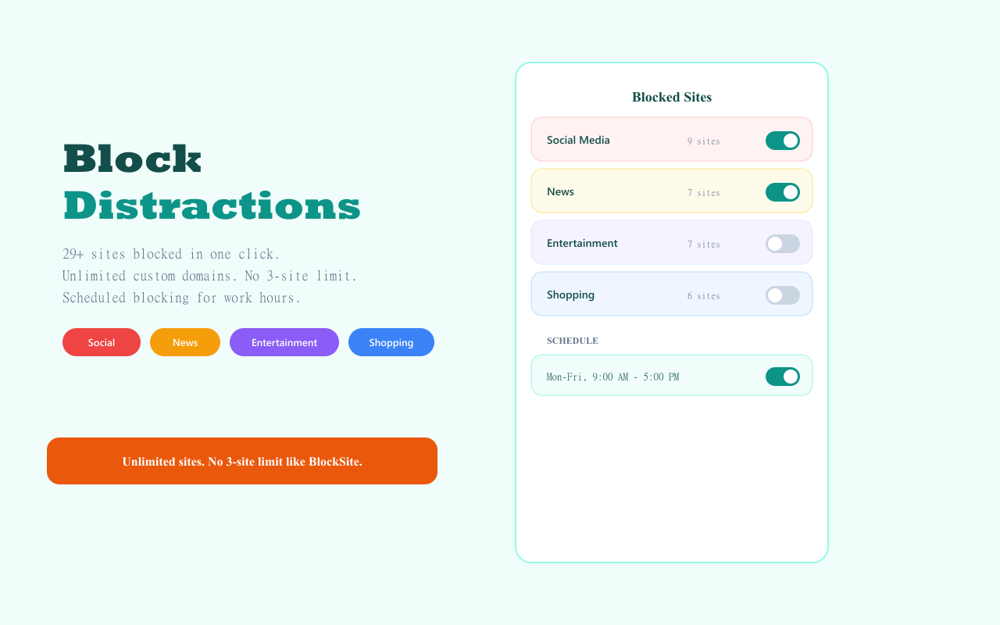

<div align="center">


# AyaMir — Pomodoro Timer, Task Manager & Site Blocker

**Free, local-first Chrome extension for deep focus. No accounts. No cloud. No tracking.**

[](https://github.com/2gelbuy/ayamir/actions/workflows/ci.yml)
[](https://github.com/2gelbuy/ayamir/releases/tag/v1.0.0)
[](https://developer.chrome.com/docs/extensions/mv3/)
[](#license)
[](#install)

Combine Pomodoro timer, smart task management, website blocking, and gamification (XP, levels, achievements) — all in one extension. Everything stays on your device.

[**Add to Chrome**](#install) &bull; [Features](#features) &bull; [Screenshots](#screenshots) &bull; [Development](#development) &bull; [Privacy](#privacy)

</div>

---

## Screenshots

<div align="center">

<br/><br/>

<br/><br/>

</div>

---

## Install

### Chrome Web Store
> Coming soon

### Manual Install
1. Download [`ayamir-1.0.0-chrome.zip`](https://github.com/2gelbuy/ayamir/releases/latest) from Releases
2. Unzip to a folder
3. Go to `chrome://extensions/` &rarr; enable **Developer Mode**
4. Click **Load unpacked** &rarr; select the unzipped folder

## Features

### Core
| Feature | Description |
|---------|-------------|
| **Smart Task Queue** | Priority-based tasks with inline editing, snooze, and completion animations |
| **Command Palette** | `Ctrl+Shift+K` from any page &mdash; auto-captures page URL |
| **Deep Work Mode** | Pomodoro timer (15 / 25 / 45 / 60 / 90 min) with circular SVG progress ring |
| **Site Blocking** | One-click category presets: Social (9), News (7), Entertainment (7), Shopping (6) + custom domains |
| **Typing Penalty** | Must type a motivational quote to bypass a blocked site during focus |

### Focus & Productivity
| Feature | Description |
|---------|-------------|
| **Scheduled Blocking** | Auto-block distracting sites during configurable work hours & days |
| **Hard Lock Mode** | Cannot cancel the Deep Work timer once started |
| **Focus Analytics** | Total sessions, focus hours, 7-day activity chart |

### Personalization
| Feature | Description |
|---------|-------------|
| **Dark Mode** | Light / Dark / System with full component coverage |
| **Gamification** | XP system, 10 levels, 8 achievements, streak tracking |
| **i18n** | English, Russian, Spanish, Chinese, Hindi |
| **Context Menu** | Right-click any page, selection, or link to save as a task |
| **Data Export/Import** | Full JSON backup & restore of all data |

## Tech Stack

| Layer | Technology |
|-------|-----------|
| Framework | [WXT](https://wxt.dev) (Manifest V3) |
| UI | React 18 + Tailwind CSS 3 |
| Storage | Dexie.js (IndexedDB) + Chrome Storage API |
| Language | TypeScript (strict) |
| CI | GitHub Actions (type check + build) |

## Project Structure

```
src/
  components/       # React UI components
    DeepWorkMode    # Pomodoro timer with hard lock
    Settings        # 4-tab settings panel
    Stats           # Analytics & gamification
    TaskInput       # Task creation with priority dots
    TaskItem        # Individual task card
    TaskList        # Filtered task list
    Onboarding      # 3-step welcome flow
    DailyFocus      # Daily priority prompt
    KeyboardHelp    # Shortcuts overlay
  entrypoints/
    background.ts   # Service worker (alarms, messages, context menu)
    content.tsx     # Content script (block page, command palette, ticker)
    popup/          # Main popup UI
  lib/
    db.ts           # Dexie schema, settings cache
    gamification.ts # XP, levels, achievements
    smartQueue.ts   # Priority sorting algorithm
    messages.ts     # Typed message constants
    theme.ts        # Dark mode management
    humor.ts        # Notification messages
  public/
    _locales/       # i18n (en, ru, es, zh_CN, hi)
    icon/           # Extension icons (16, 48, 128, SVG)
```

## Development

### Prerequisites
- Node.js 18+
- npm

### Quick Start

```bash
git clone https://github.com/2gelbuy/ayamir.git
cd ayamir
npm install
npm run dev          # Dev mode with hot reload
```

### Scripts

| Command | Description |
|---------|-------------|
| `npm run dev` | Start dev server with hot reload |
| `npm run build` | Production build to `.output/chrome-mv3/` |
| `npm run zip` | Create CWS-ready ZIP package |
| `npx tsc --noEmit` | Type check without emitting |

### Loading in Chrome

1. Run `npm run build`
2. Open `chrome://extensions/`
3. Enable **Developer Mode**
4. Click **Load unpacked** &rarr; select `.output/chrome-mv3/`

## Keyboard Shortcuts

| Shortcut | Action |
|----------|--------|
| `Ctrl+Shift+E` | Open AyaMir popup |
| `Ctrl+Shift+K` | Command Palette (from any page) |
| `N` or `/` | New task (when popup is open) |
| `D` | Deep Work Mode |
| `S` | Settings |
| `V` | Stats & XP |
| `?` | Keyboard shortcuts help |

## Privacy

AyaMir is **100% local**. Your data never leaves your device.

- No servers, no accounts, no analytics
- All data stored in IndexedDB and Chrome Storage API
- Full data export/import for portability
- [Read the full Privacy Policy](PRIVACY.md)

## Changelog

See [CHANGELOG.md](CHANGELOG.md) for release history.

## Contributing

Contributions are welcome! Please read [CONTRIBUTING.md](CONTRIBUTING.md) before submitting a PR.

## License

[MIT](LICENSE) &copy; 2026 [Tugelbay Konabayev](https://konabayev.com)
